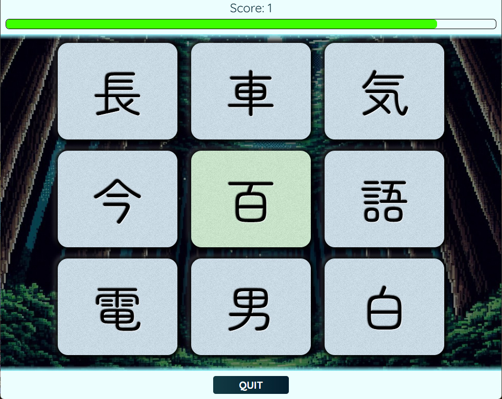

# Kanji Memory

Kanji Memory is take on the standard memory game. Clicking a tile refreshes all nine tiles and stores that particular kanji in memory. If you click on a kanji that you've clicked on previously that is a game over. Higher points are awarded the faster you click through kanji selections. Different difficulties are available based on different sets of Kanji (although only N5 is likely accurate).